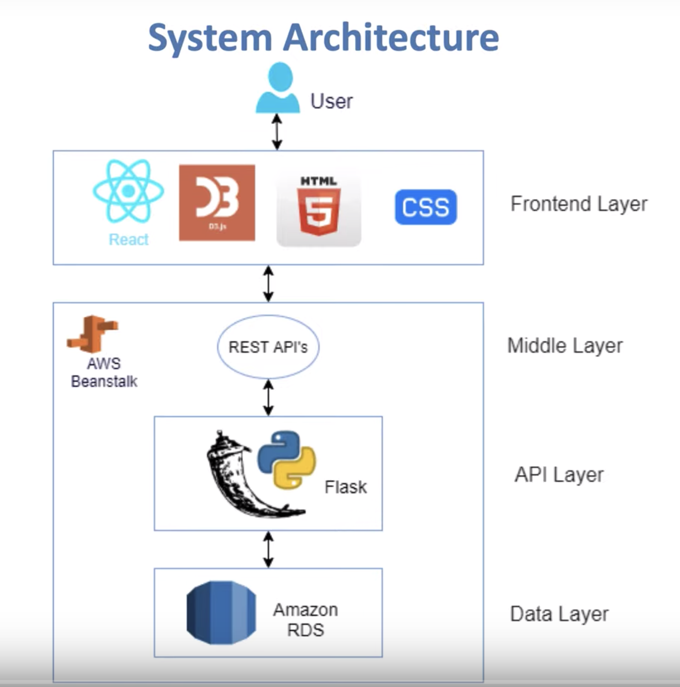

## Stock Portfolio Suggestion Engine

"Stock Portfolio Suggestion Engine" is built as part of coursework CMPE-285 at San Jose State University. The aim of this project is to develop a stock suggestion engine based on investment strategy and investment amount. 

### System Architecture

The REST API layer is built in python3 and Flask infrastructure. And front-end was built using React.JS, Redux and Material Design. The project no longer supports Amazon RDS and stores the user information locally in server memory. ~~The user information is stored on Amazon RDS~~. The project is hosted on AWS beanstalk here http://stock-env.xwcpz5tgzz.us-west-1.elasticbeanstalk.com/#.

### Platform Features:
<ul>
<li>
  Stock suggestions based on investment strategy and investment amount. The engine provides the details of number of stock, portfolio diversity ratio and holding value. 
</li>
<li>
  Weekly trend of individual stocks and total portfolio. 
</li>
<li>
  Realtime tickers with latest price of various stocks. Latest market trends widget with details of Active, Gainer and looser stocks for 1D, 1M, 3M, 1Y, 5Y and all time periods. 
</li>
<li>
  Secure Signup and Signin functionality.
</li>
</ul>

### How to setup and run the project locally:

- Python 3.6 and above.
- Open cmd console
- Use cd command to navigate to the 'backend' folder.
- Install all required dependencies using command: pip(pip3) install -r requirements.txt
- Install other packages if needed.
- Run python file by using: python backend/application.py
- Open web browser and type: http://0.0.0.0/

### Credits
<a href="http://nikitabairagi.com" target="_blank">Nikita Bairagi | nikitabairagi.com</a>, Student at San Jose State University. 

### License
MIT
